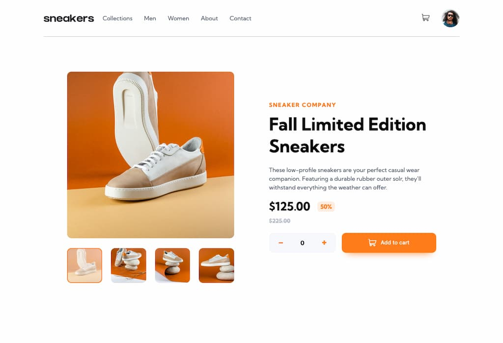

# Frontend Mentor - E-commerce product page solution

This is a solution to the [E-commerce product page challenge on Frontend Mentor](https://www.frontendmentor.io/challenges/ecommerce-product-page-UPsZ9MJp6). Frontend Mentor challenges help you improve your coding skills by building realistic projects.

## The challenge

The personal challange for this project was to learn more about the principles of [https://getbem.com/introduction/](https://getbem.com/introduction/). In order to focus on this, I did not use any major frameworks for my solution. The original goals set by Front-end mentor are also simplified a bit by altering the gallery implementation. Additionally, the page is build with basic web accessibility in mind.

- View the optimal layout for the site depending on their device's screen size
- See hover states for all interactive elements on the page
- ~~Open a lightbox gallery by clicking on the large product image~~
- Switch the large product image by clicking on the small thumbnail images
- Add items to the cart
- View the cart and remove items from it

## Links

- Solution URL: [https://n9iels.github.io/ecommerce-product-page/](https://n9iels.github.io/ecommerce-product-page/)

## Screenshot

## Built with

- Semantic HTML5 markup
- CSS custom properties
- Flexbox
- CSS Grid

## Used tools

- Vite Bundler
- Stylelint
